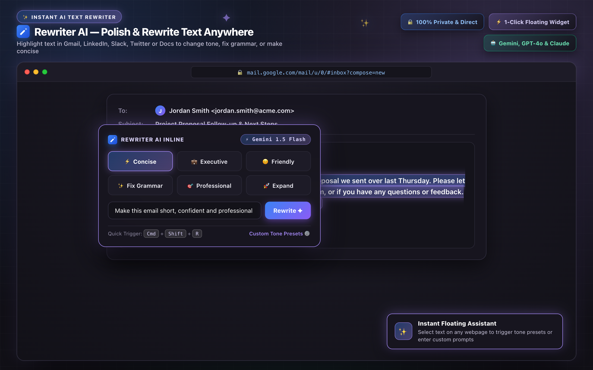
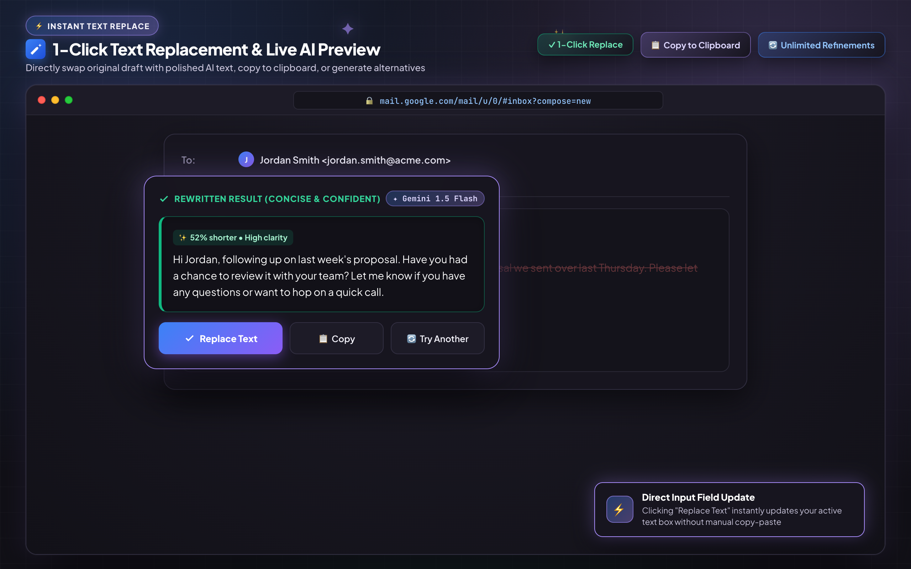
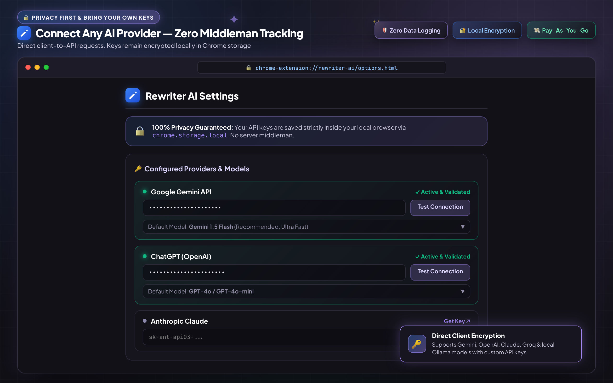
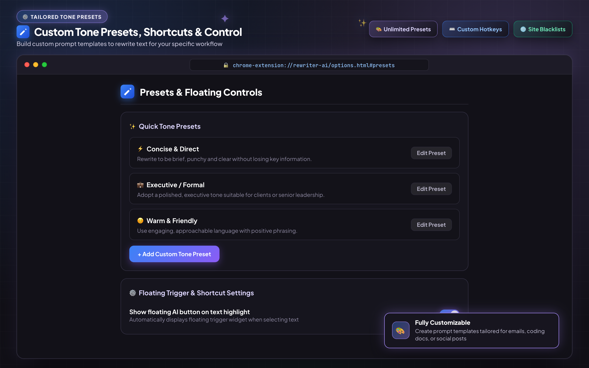

<div align="center">

  

  # Rewriter AI
  ### Rewrite Anywhere. Chat Anywhere. Your API Keys.

  [](https://rewriter.bhaggat.in/)
  [](https://github.com/bhaggat/rewriter-ai)
  [](LICENSE)
  [](https://rewriter.bhaggat.in/privacy-policy.html)

  <p align="center">
    <strong>Rewriter AI</strong> is a privacy-first Chrome extension (MV3) that adds an AI writing assistant directly to every text field on the web, plus a full conversational AI popup right in your browser toolbar.
    <br />
    Connect your own API keys for <strong>OpenAI, Gemini, Claude, Grok, Groq, Mistral, or OpenRouter</strong> with <strong>zero middleman backend</strong>.
  </p>

  <p align="center">
    <a href="https://rewriter.bhaggat.in/"><strong>🌐 Visit Official Website</strong></a> •
    <a href="https://github.com/bhaggat/rewriter-ai"><strong>🧩 Chrome Extension Repo</strong></a> •
    <a href="https://rewriter.bhaggat.in/privacy-policy.html"><strong>🔒 Privacy Policy</strong></a>
  </p>

</div>

---

## 🔗 Quick Links

- 🌐 **Official Website**: [https://rewriter.bhaggat.in/](https://rewriter.bhaggat.in/)
- 🧩 **Extension Download / Repo**: [https://github.com/bhaggat/rewriter-ai](https://github.com/bhaggat/rewriter-ai)
- 🔒 **Privacy Policy**: [https://rewriter.bhaggat.in/privacy-policy.html](https://rewriter.bhaggat.in/privacy-policy.html)

---

## 📸 Preview & Screenshots

| 🪄 Instant Inline AI Rewriter | ✨ 1-Click Text Replace |
| :---: | :---: |
|  |  |

| ⚙️ Multi-Provider BYOK Settings | 📝 Custom Tone Presets Management |
| :---: | :---: |
|  |  |

---

## ✨ Features

- 🪄 **Inline AI Writing Assistant**: Focus any editable field on any website (Gmail, X/Twitter, GitHub, Notion, Reddit, docs, forms) and trigger an instant rewrite widget.
- ⚡ **Instant Keyboard Shortcut**: Press `Alt+Shift+R` (or `Cmd+Alt+R` / custom binding) anywhere on the web to open the inline rewrite floating panel immediately.
- 💬 **Full Toolbar Chat Panel**: Access a rich AI chat interface right from the extension popup icon or pop it into a dedicated window.
- 🔒 **BYOK (Bring Your Own Key)**: Direct client-to-LLM requests. No proxy servers, no telemetry, no subscription markup, and no data tracking.
- 🎨 **Smart Presets & Custom Styles**: Pre-loaded with essential styles (*Concise*, *Formal*, *Friendly*, *Fix Grammar*, *Professional*, *Expand*, *Summarize*) plus full support for custom user prompt templates.
- 🧠 **Memory & Workflow Smoothness**: Automatically remembers your last used rewrite style for friction-free repetitive writing.
- 🌐 **7 Top AI Providers Supported**: Seamlessly switch between models from OpenAI, Google Gemini, Anthropic Claude, xAI Grok, Groq, Mistral, and OpenRouter.
- 🛡️ **Granular Site Controls**: Enable or disable the floating inline icon globally, or whitelist/blacklist specific domains.

---

## 🤖 Supported Providers & Models

| Provider | Supported Models / Features | BYOK Security |
| :--- | :--- | :--- |
| **OpenAI** | GPT-4o, GPT-4o-mini, o1, o3-mini | Direct requests to `api.openai.com` |
| **Google Gemini** | Gemini 2.5 Flash, Gemini 2.5 Pro | Direct requests to `generativelanguage.googleapis.com` |
| **Anthropic Claude** | Claude 3.5 Sonnet, Claude 3.5 Haiku | Direct requests to `api.anthropic.com` |
| **xAI Grok** | Grok 2, Grok Vision | Direct requests to `api.x.ai` |
| **Groq** | Llama 3.3 70B, DeepSeek R1 Distill | Direct requests to `api.groq.com` |
| **Mistral AI** | Mistral Large, Pixtral | Direct requests to `api.mistral.ai` |
| **OpenRouter** | 200+ Open Models (DeepSeek, Qwen, Llama, etc.) | Direct requests to `openrouter.ai` |

---

## ⌨️ Keyboard Shortcuts

| Action | Default Windows / Linux | Default Mac |
| :--- | :--- | :--- |
| **Trigger Inline Rewrite** | `Alt` + `Shift` + `R` | `Option` + `Shift` + `R` |
| **Close Inline Popup** | `Escape` | `Escape` |
| **Apply / Replace Selection** | `Enter` (or click Replace) | `Enter` (or click Replace) |

> 💡 *Shortcuts can be customized anytime in Chrome at `chrome://extensions/shortcuts`.*

---

## 🛡️ Privacy & Security Architecture

Rewriter AI was built from the ground up with a zero-trust privacy model:

1. **Zero Intermediate Servers**: Your browser sends API requests **directly** to OpenAI, Google, Anthropic, xAI, Groq, Mistral, or OpenRouter.
2. **Local Storage Only**: API keys, custom prompts, and chat history are saved strictly in your browser's encrypted local storage (`chrome.storage.local`).
3. **No Telemetry / No Tracking**: No analytics scripts, no external pingbacks, no third-party cookies.
4. **Focused DOM Reading**: The content script only reads text from the active input element when you trigger a rewrite—never scanning or storing web page contents.

Read our complete [Privacy Policy](https://rewriter.bhaggat.in/privacy-policy.html) for detailed disclosure.

---

## 🚀 Installation & Local Development

### Option A: Install Built Extension (Developer Mode)

1. Download or clone this repository:
   ```bash
   git clone https://github.com/bhaggat/rewriter-ai.git
   cd rewriter-ai
   ```
2. Install dependencies and build the extension:
   ```bash
   npm install
   npm run build
   ```
3. Open Google Chrome and navigate to `chrome://extensions/`.
4. Enable **Developer mode** in the top-right corner.
5. Click **Load unpacked** and select the `dist/chrome-mv3` directory.

### Option B: Local Development with HMR

Run the dev server with hot module reloading via [WXT](https://wxt.dev):

```bash
npm run dev
```

---

## 🛠️ Tech Stack

- **Extension Framework**: [WXT (Web Extension Tools)](https://wxt.dev) (Manifest V3)
- **UI Framework**: [React 19](https://react.dev/) + [TypeScript](https://www.typescriptlang.org/)
- **Build Tool**: [Vite 8](https://vitejs.dev/)
- **Icons & Styling**: Custom SVG Design System & Modern CSS Variables

---

## 📄 License

This project is licensed under the **MIT License**. See the [LICENSE](LICENSE) file for details.

---

<div align="center">

  Made with ❤️ by [kanukabhagat](https://github.com/bhaggat)

  **[Website](https://rewriter.bhaggat.in/)** • **[GitHub](https://github.com/bhaggat/rewriter-ai)** • **[Privacy Policy](https://rewriter.bhaggat.in/privacy-policy.html)**

</div>
